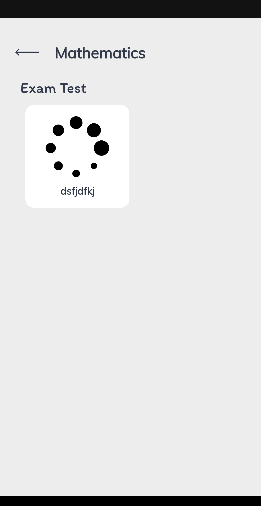
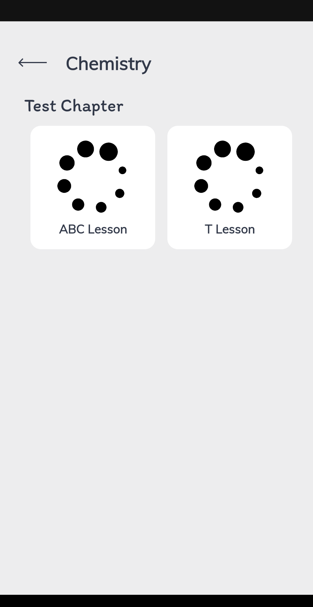
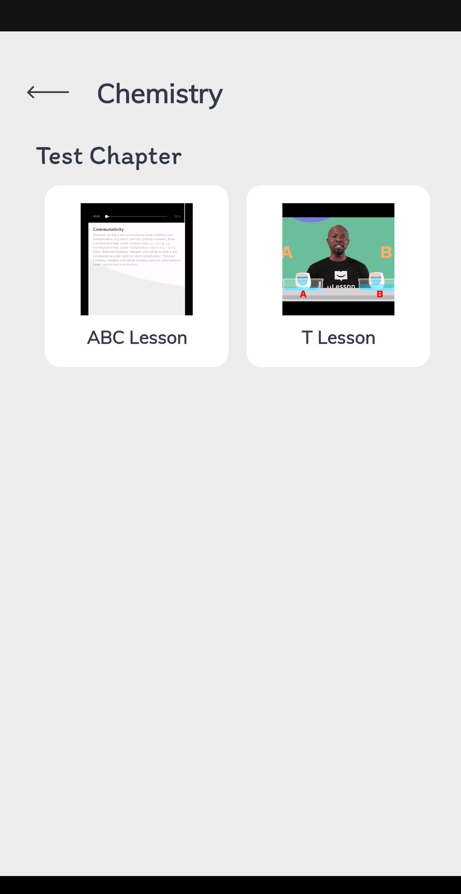
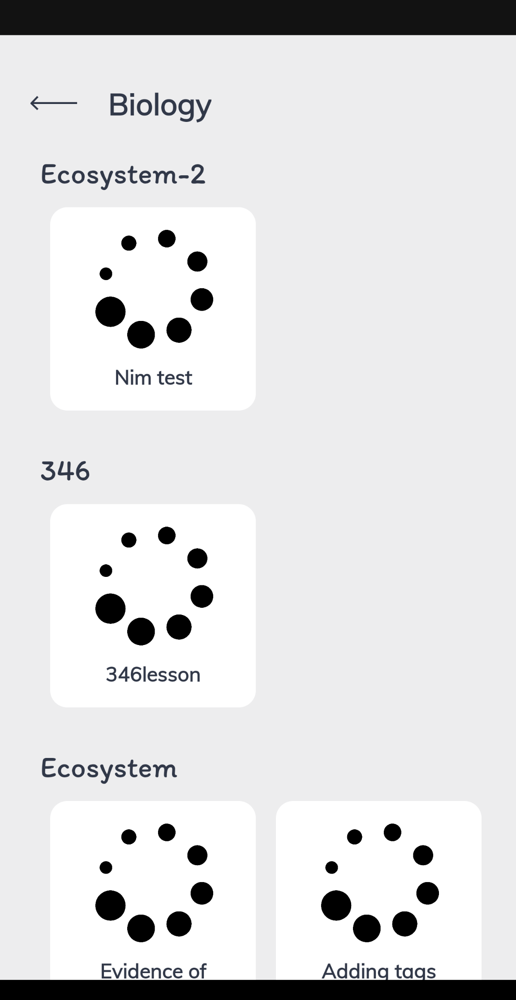
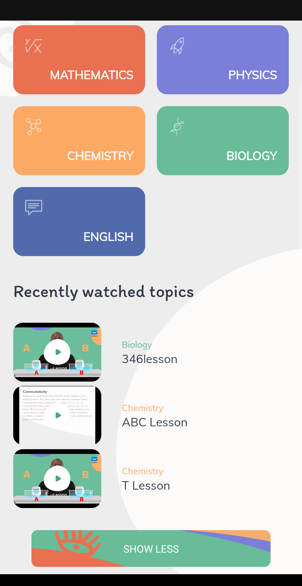
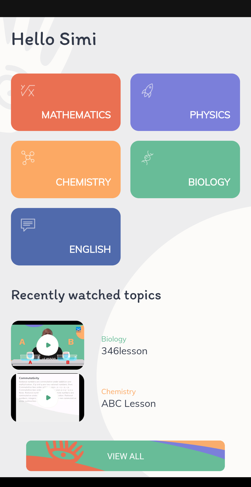
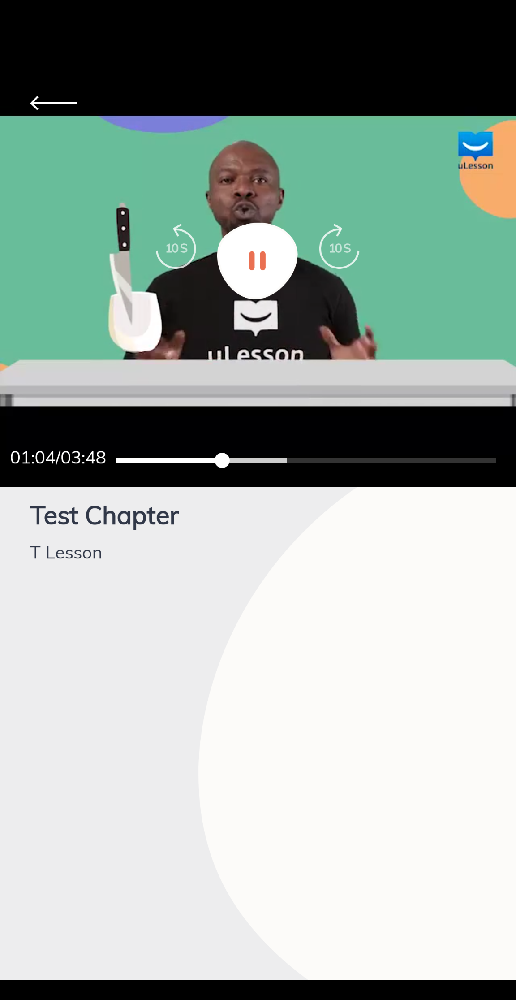

# Elearning App
Elearning app for streaming video content

Contains:
- MVVM architecture
- Dependency injection with dagger
- Modular clean architecture
- DiffUtil to update recyclerview
- Exoplayer with custom controller to play video
- Coroutines for multithreading
- Retrofit for network calls
- Glide to display images
- Room for data persistence
- Mappers for mapping different entities from the different modules
- Android viewBinding library
- Unit test for mappers
- ViewModel test
- Room coroutine test

  
  
  
  
  
  
  

